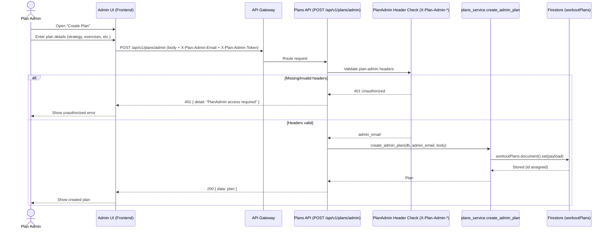

# Plan Admin — Create Workout Plan (Sequence Diagram)

## Create Plan (7–8 steps)

1. Plan Admin opens the **Create Plan** screen.
2. Admin enters the workout plan details (title, strategy, exercises, etc.).
3. UI sends `POST /api/v1/plans/admin` with `X-Plan-Admin-Email` and `X-Plan-Admin-Token`.
4. API validates the plan-admin headers (invalid → `401 PlanAdmin access required`).
5. If valid, API calls `create_admin_plan(db, admin_email, body)`.
6. Service writes a new document to Firestore collection `workoutPlans` (adds `ownerEmail`, timestamps).
7. Firestore assigns the document ID and write completes.
8. API returns `200 { data: plan }` and UI shows “plan created”.
