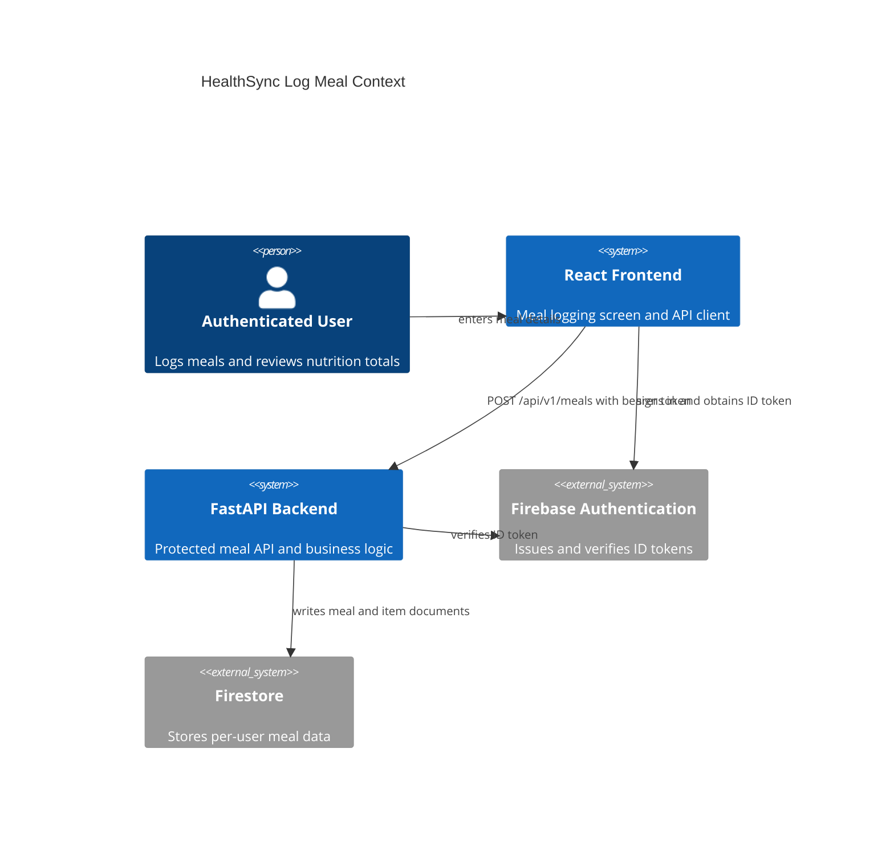
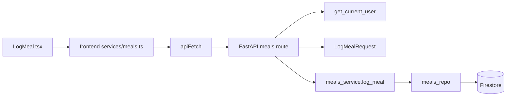
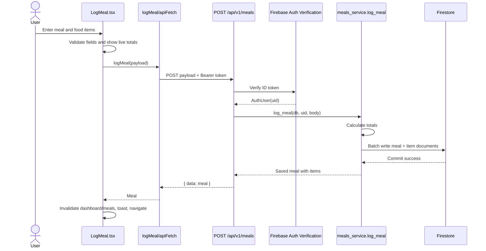

# Task 2: IEEE 42010 Architecture Framework

## Stakeholders, Concerns, Viewpoints, and Views

| Stakeholder | Concerns | Viewpoint | View Used in This Artifact |
| --- | --- | --- | --- |
| HealthSync user | Fast meal entry, accurate totals, private health data, mobile usability. | User interaction viewpoint | Meal logging UI flow and validation behavior. |
| Developer team | Clear responsibilities, testable logic, easy extension to edit/import meals. | Module decomposition viewpoint | Frontend service + FastAPI route + service + repository module view. |
| Instructor/evaluator | Evidence of requirements, ADRs, tactics, patterns, and analysis. | Architecture documentation viewpoint | Report, ADRs, diagrams, and analysis tables. |
| Security reviewer | Authenticated access, user isolation, safe Firebase credential handling. | Security viewpoint | Firebase token verification and per-user Firestore path view. |
| Maintainer/operator | Debuggability, response timing, setup clarity, environment variables. | Runtime viewpoint | API request/response and observability view. |

## Context View

## Module View

## Runtime Sequence View

## Security View

- The frontend never uses the Firebase Admin SDK service account.
- The frontend obtains a Firebase ID token from the signed-in browser user.
- `apiFetch` sends `Authorization: Bearer <token>`.
- `get_current_user` verifies the token on the backend.
- The route passes `user.uid` into `meals_service.log_meal`.
- `meals_repo.meals_ref(db, uid)` stores under `users/{uid}/meals`.

