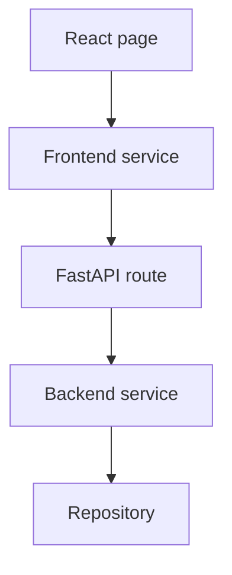
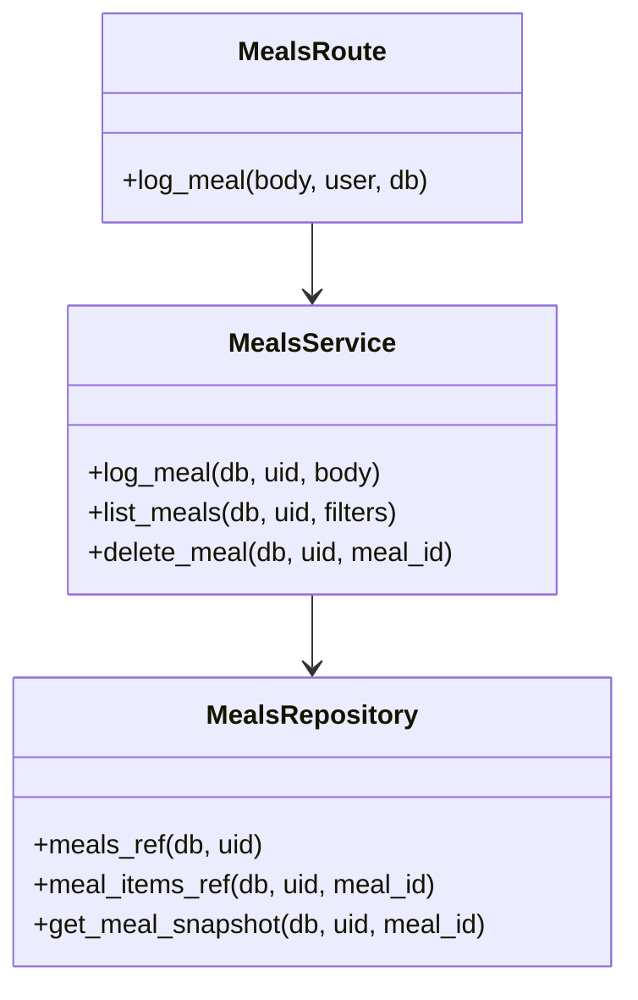

# Task 3: Architectural Tactics and Implementation Patterns

## Architectural Tactics

| Tactic | Quality Attribute | How It Is Applied in Log Meal |
| --- | --- | --- |
| Authenticate at API boundary | Security | `POST /api/v1/meals` depends on `get_current_user`, so unauthenticated requests cannot reach the service layer. |
| Partition data by user ID | Security/privacy | Repository paths write meals under `users/{uid}/meals`, where `uid` comes from verified auth context. |
| Validate at multiple boundaries | Data integrity | Frontend rejects invalid rows early; backend Pydantic schema enforces non-negative numeric fields before persistence. |
| Server-side aggregate calculation | Data integrity/maintainability | Backend service calculates calories/macros totals from item inputs, making persisted totals consistent. |
| Batch database writes | Performance/consistency | Meal document and item documents are committed together through a Firestore batch. |
| Query invalidation after mutation | Usability/consistency | React Query invalidates `dashboard` and `meals` after save so the visible app state refreshes. |
| Request logging and correlation ID | Observability | FastAPI middleware logs method, path, status, duration, and request ID. |

## Implementation Patterns

### Pattern 1: Service Layer

Location:

- Frontend: `frontend/src/services/meals.ts`
- Backend: `backend/app/services/meals_service.py`

Role:

- Keeps API interaction separate from React rendering.
- Keeps business logic separate from HTTP route handlers.
- Makes meal total calculation easier to unit test and reuse.

### Pattern 2: Repository Pattern

Location:

- `backend/app/repositories/meals_repo.py`

Role:

- Encapsulates Firestore collection paths.
- Keeps service logic independent from raw Firestore path construction.
- Makes future storage changes less invasive.

