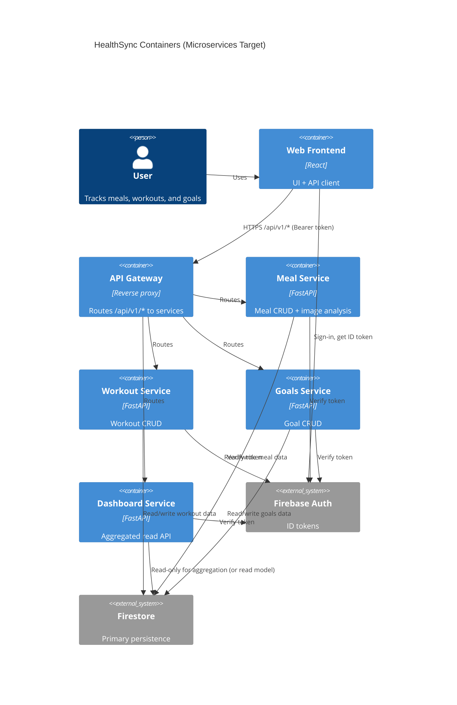

# HealthSync — Microservices Decomposition (Proposed)

This is a proposed target architecture to run each major feature as an independently deployable microservice so partial functionality remains available if one service is down.

## Goals

- Failure isolation: meal logging can work even if workout service is down (and vice versa).
- Independent deployability: services can be updated without redeploying the whole backend.
- Clear ownership: each service owns its API and persistence model.

## Proposed services (feature-aligned)

| Service | Responsibilities | Primary data |
| --- | --- | --- |
| `meal-service` | Meal CRUD; image-based meal analysis/inference | `users/{uid}/meals/*` (+ items subcollection) |
| `workout-service` | Workout CRUD | `users/{uid}/workouts/*` |
| `goals-service` | Goal CRUD | `users/{uid}/goals/*` or `users/{uid}/activeGoal` |
| `dashboard-service` | Aggregated daily summary; graceful partial responses | Read model or cross-collection reads |
| `profile-service` (future) | User profile/preferences/allergies | `users/{uid}/profile` |
| `analytics-service` (future) | Trends/charts; reporting endpoints | Derived read model |
| `recommendation-service` (future) | Workout/nutrition recommendations | Derived state + cached suggestions |
| `notification-service` (future) | Reminders via FCM/email | Scheduled jobs + user prefs |
| `export-service` (future) | CSV/PDF export/import | Batch jobs + storage |

## Request routing options

Option A (recommended for a single frontend base URL): run an API gateway/reverse proxy that routes:

- `/api/v1/meals/*` → `meal-service`
- `/api/v1/workouts/*` → `workout-service`
- `/api/v1/goals/*` → `goals-service`
- `/api/v1/dashboard/*` → `dashboard-service`

Option B: frontend calls each service directly (multiple base URLs). Simpler runtime, but more frontend configuration.

## Container view (C4-style)

## Failure behavior (what “still works” means)

- If `meal-service` is down: workouts/goals can still be logged; dashboard can still return workout-side values and mark meal-side fields as unavailable.
- If `workout-service` is down: meal logging still works; dashboard degrades similarly.
- If `dashboard-service` is down: CRUD features still work; only dashboard view fails.
- If the gateway is down: everything behind it fails (so in production this should be HA); in local dev it is acceptable.

